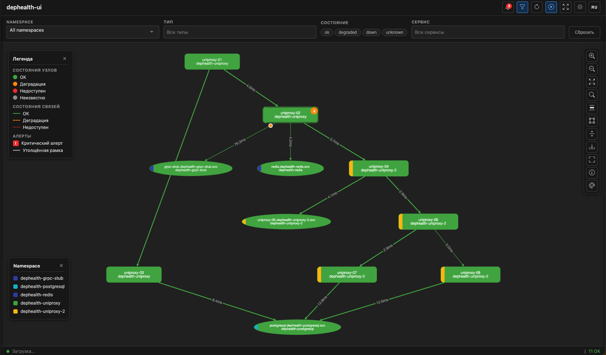
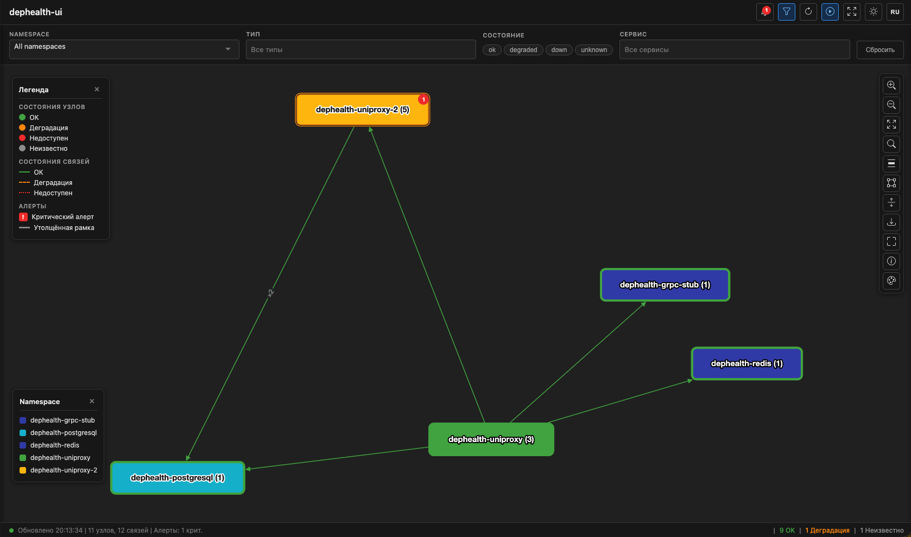
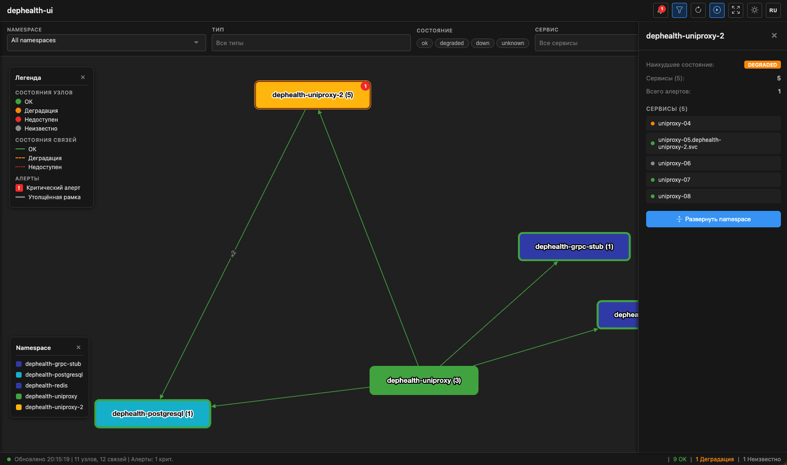

# dephealth-ui

[](https://github.com/BigKAA/dephealth-ui)
[](https://golang.org/)
[](./deploy/helm/dephealth-ui)
[](./LICENSE)

**Визуализация топологии и здоровья микросервисов в реальном времени**

**Язык:** [English](./README.md) | Русский

---

## Обзор

**dephealth-ui** — веб-приложение для визуализации топологии микросервисов и мониторинга состояния зависимостей в реальном времени. Отображает интерактивный направленный граф с состояниями сервисов (OK, DEGRADED, DOWN), latency соединений и предоставляет прямые ссылки на дашборды Grafana.

Приложение потребляет метрики, собранные [dephealth SDK](https://github.com/BigKAA/topologymetrics) из Prometheus/VictoriaMetrics, и коррелирует их с алертами AlertManager для предоставления единого представления о здоровье системы.







## Возможности

✅ **Визуализация топологии в реальном времени**
- Интерактивная диаграмма узлов с Cytoscape.js
- Двойной layout: dagre (плоский режим) и fcose (группировка)
- Цветовая индикация состояний (зелёный=OK, жёлтый=DEGRADED, красный=DOWN, серый=Unknown/stale)
- Динамический размер узлов в зависимости от длины текста
- Удержание stale-нод с настраиваемым окном lookback

✅ **Группировка по namespace**
- Группировка сервисов по Kubernetes namespace в составные узлы
- Сворачивание/разворачивание групп (двойной клик или кнопка в sidebar)
- Свёрнутые ноды показывают наихудшее состояние, кол-во сервисов и бейджи алертов
- Агрегированные рёбра между свёрнутыми namespace
- Навигация click-to-expand из sidebar свёрнутого namespace к конкретному сервису
- Детерминированная палитра цветов namespace с WCAG-контрастностью
- Состояние collapse/expand сохраняется в localStorage

✅ **Каскадные предупреждения и модель состояний**
- Модель из 4 состояний: OK, DEGRADED, DOWN, UNKNOWN с точными правилами вычисления
- Визуализация каскадного распространения сбоев через критические зависимости
- Автоматическое определение корневых причин с помощью алгоритма BFS
- Бейджи каскадных предупреждений (`⚠ N`) на затронутых вышестоящих узлах с tooltip'ом корневой причины
- Умная фильтрация с виртуальным состоянием «warning» и видимостью цепочки degraded/down

✅ **Полный мониторинг**
- Статус здоровья сервисов с количеством алертов
- Отображение latency на рёбрах (средний и P99 перцентиль)
- Выделение критичных зависимостей (толще рёбра)
- Интеграция с активными алертами AlertManager

✅ **Богатый UI**
- Умный поиск с fuzzy matching
- Множественные фильтры (namespace, тип, состояние, сервис)
- Drawer алертов с группировкой по severity
- Боковая панель узла с инстансами, связанными рёбрами и ссылками на Grafana дашборды
- Боковая панель ребра с состоянием, latency, алертами, связанными узлами и Grafana ссылками
- Боковая панель свёрнутого namespace с кликабельным списком сервисов и кнопкой разворачивания
- Интеграция с Grafana: контекстное меню, ссылки на все 5 дашбордов с контекстно-зависимыми параметрами
- Контекстное меню (правый клик) на узлах/рёбрах: Открыть в Grafana, Копировать URL, Детали
- Интернационализация (i18n): английский и русский
- Цветовая кодировка namespace с детерминированной палитрой
- Легенда, легенда namespace, статистика, экспорт в PNG
- Горячие клавиши и полноэкранный режим
- Поддержка тёмной темы

✅ **Enterprise-ready**
- Несколько режимов аутентификации (none, Basic, OIDC/SSO)
- CORS для браузерных клиентов
- Серверное кэширование (настраиваемый TTL)
- Multi-arch Docker образы (amd64, arm64)
- Kubernetes-native с Helm chart
- Поддержка Gateway API и Ingress

## Архитектура

```
┌─────────────────────┐
│  Браузер (SPA)      │  ← Cytoscape.js + Vite
│  Vanilla JS         │
└──────────┬──────────┘
           │ HTTPS (REST API)
           ▼
┌─────────────────────────────────┐
│  dephealth-ui (Go)              │  ← Единый бинарник
│  ┌─────────────────────────┐   │
│  │ REST API                │   │  /api/v1/topology
│  │ /api/v1/alerts          │   │  /api/v1/instances
│  │ /api/v1/config          │   │  /api/v1/config
│  └─────────────────────────┘   │
│  ┌─────────────────────────┐   │
│  │ Topology Service        │   │  ← PromQL-запросы
│  │ Alert Aggregation       │   │  ← AlertManager API
│  │ In-memory Cache (TTL)   │   │
│  └─────────────────────────┘   │
│  ┌─────────────────────────┐   │
│  │ Auth (none/basic/oidc)  │   │  ← Подключаемый
│  └─────────────────────────┘   │
└──────────┬──────────────────────┘
           │
           ▼
┌──────────────────────────────────┐
│ Prometheus/VictoriaMetrics       │  ← app_dependency_health
│ AlertManager                     │  ← app_dependency_latency_seconds
└──────────────────────────────────┘
```

## Технологический стек

| Компонент | Технология |
|-----------|------------|
| **Backend** | Go 1.25 (net/http + chi router) |
| **Frontend** | Vanilla JS + Vite + Cytoscape.js + Tom Select |
| **Визуализация** | Cytoscape.js + dagre (плоский) + fcose (группировка) |
| **Контейнер** | Docker (multi-stage, multi-arch) |
| **Оркестрация** | Kubernetes (Helm 3) |

---

## Быстрый старт

### Предварительные требования

- Кластер Kubernetes с Gateway API или Ingress controller
- Prometheus/VictoriaMetrics с метриками [dephealth SDK](https://github.com/BigKAA/topologymetrics)
- AlertManager (опционально, для интеграции алертов)
- Helm 3.0+

### Установка

#### 1. Добавление Helm-репозитория (если опубликован)

```bash
# При использовании Helm-репозитория
helm repo add dephealth https://charts.dephealth.io
helm repo update
```

#### 2. Установка через Helm

**С использованием Gateway API:**
```bash
helm install dephealth-ui ./deploy/helm/dephealth-ui \
  --set route.enabled=true \
  --set route.hostname=dephealth.example.com \
  --set tls.enabled=true \
  --set tls.issuerName=letsencrypt-prod \
  --set config.datasources.prometheus.url=http://victoriametrics:8428 \
  --set config.datasources.alertmanager.url=http://alertmanager:9093 \
  -n dephealth-ui --create-namespace
```

**С использованием Ingress:**
```bash
helm install dephealth-ui ./deploy/helm/dephealth-ui \
  --set ingress.enabled=true \
  --set ingress.className=nginx \
  --set ingress.hostname=dephealth.example.com \
  --set ingress.tls.enabled=true \
  --set ingress.tls.certManager.enabled=true \
  --set ingress.tls.certManager.issuerName=letsencrypt-prod \
  --set config.datasources.prometheus.url=http://victoriametrics:8428 \
  -n dephealth-ui --create-namespace
```

#### 3. Доступ к UI

Откройте браузер и перейдите по адресу:
```
https://dephealth.example.com
```

---

## Конфигурация

### Конфигурация приложения

Создайте `config.yaml`:

```yaml
server:
  listen: ":8080"

datasources:
  prometheus:
    url: "http://victoriametrics.monitoring.svc:8428"
    # Опционально: Basic auth для Prometheus
    # username: "reader"
    # password: "secret"
  alertmanager:
    url: "http://alertmanager.monitoring.svc:9093"

cache:
  ttl: 15s  # Время жизни кэша топологии

auth:
  type: "none"  # Варианты: "none", "basic", "oidc"

  # Basic-аутентификация
  # basic:
  #   users:
  #     - username: admin
  #       passwordHash: "$2a$10$..."  # bcrypt хэш

  # OIDC-аутентификация
  # oidc:
  #   issuer: "https://dex.example.com"
  #   clientId: "dephealth-ui"
  #   clientSecret: "ZGVwaGVhbHRoLXVpLXNlY3JldA"
  #   redirectUrl: "https://dephealth.example.com/auth/callback"

grafana:
  baseUrl: "https://grafana.example.com"
  dashboards:
    serviceStatus: "dephealth-service-status"
    linkStatus: "dephealth-link-status"
    serviceList: "dephealth-service-list"
    servicesStatus: "dephealth-services-status"
    linksStatus: "dephealth-links-status"
```

### Переменные окружения

Все параметры конфигурации можно переопределить через переменные окружения:

```bash
DEPHEALTH_SERVER_LISTEN=":8080"
DEPHEALTH_DATASOURCES_PROMETHEUS_URL="http://victoriametrics:8428"
DEPHEALTH_DATASOURCES_ALERTMANAGER_URL="http://alertmanager:9093"
DEPHEALTH_CACHE_TTL="15s"
DEPHEALTH_AUTH_TYPE="none"
DEPHEALTH_GRAFANA_BASEURL="https://grafana.example.com"
```

---

## Необходимые метрики

dephealth-ui требует две Prometheus-метрики от сервисов, инструментированных [dephealth SDK](https://github.com/BigKAA/topologymetrics):

### 1. `app_dependency_health` (Gauge)

Состояние здоровья endpoint'ов зависимостей (1=UP, 0=DOWN).

**Обязательные метки:**
- `name` — имя сервиса
- `namespace` — Kubernetes namespace
- `dependency` — логическое имя зависимости
- `type` — тип соединения (http, grpc, postgres, redis и т.д.)
- `host` — hostname целевого endpoint'а
- `port` — порт целевого endpoint'а
- `critical` — флаг критичности (yes/no)

**Пример:**
```prometheus
app_dependency_health{name="order-service",namespace="prod",dependency="postgres-main",type="postgres",host="pg.svc",port="5432",critical="yes"} 1
```

### 2. `app_dependency_latency_seconds` (Histogram)

Latency health check'ов в секундах со стандартными bucket'ами: `0.001, 0.005, 0.01, 0.05, 0.1, 0.5, 1.0, 5.0`

**Полная спецификация:** [docs/METRICS.ru.md](./docs/METRICS.ru.md)

---

## Разработка

### Локальная разработка

#### Предварительные требования

- Go 1.25+
- Node.js 22+
- Docker (опционально)

#### Сборка фронтенда

```bash
cd frontend
npm install
npm run dev  # Сервер разработки с HMR
# или
npm run build  # Продакшен-сборка
```

#### Сборка backend

```bash
go mod download
go build -o dephealth-ui ./cmd/dephealth-ui
```

#### Локальный запуск

```bash
./dephealth-ui -config config.yaml
```

### Сборка Docker-образа

```bash
# Сборка multi-arch образа
make docker-build TAG=v0.13.0

# Или вручную
docker buildx build \
  --platform linux/amd64,linux/arm64 \
  -t container-registry.cloud.yandex.net/crpklna5l8v5m7c0ipst/dephealth-ui:v0.13.0 \
  --push .
```

### Тестирование

```bash
# Backend-тесты
go test ./... -v -race

# Frontend-тесты
cd frontend
npm test
```

---

## Документация

| Документ | Описание |
|----------|----------|
| **[METRICS.ru.md](./docs/METRICS.ru.md)** | **НАЧНИТЕ ОТСЮДА** — Формат метрик, обязательные метки, PromQL-запросы |
| **[API.ru.md](./docs/API.ru.md)** | Справочник REST API со всеми endpoint'ами |
| **[Helm Chart README](./deploy/helm/dephealth-ui/README.ru.md)** | Руководство по развёртыванию в Kubernetes |
| **[Тестовая площадка](./deploy/README.ru.md)** | Настройка тестовой среды, топология, адаптация под своё окружение |
| **[Application Design](./docs/application-design.ru.md)** | Обзор архитектуры и проектные решения |
| **[English Documentation](./README.md)** | Полная документация на английском |

---

## Структура проекта

```
dephealth-ui/
├── cmd/dephealth-ui/          # Точка входа приложения
├── internal/                  # Go-пакеты
│   ├── config/               # Обработка конфигурации
│   ├── server/               # HTTP-сервер + маршруты
│   ├── topology/             # Сервис топологии (Prometheus-запросы)
│   ├── alerts/               # Интеграция с AlertManager
│   ├── auth/                 # Аутентификация (none/basic/oidc)
│   └── cache/                # In-memory кэш с TTL
├── frontend/                  # Vite + Cytoscape.js SPA
│   ├── src/                  # JavaScript-модули (graph, sidebar, grouping, i18n и др.)
│   ├── public/               # Статические ресурсы
│   └── index.html            # Точка входа SPA
├── deploy/                    # Манифесты развёртывания
│   ├── docker/               # Docker Compose для bare metal
│   └── helm/                 # Helm-чарты
│       ├── dephealth-ui/     # Чарт приложения
│       ├── dephealth-infra/  # Тестовая инфраструктура
│       ├── dephealth-uniproxy/  # Тестовые прокси-экземпляры
│       └── dephealth-monitoring/  # Стек мониторинга
├── docs/                      # Документация
└── test/                      # Тестовые утилиты и фикстуры
```

---

## Участие в разработке

1. Сделайте форк репозитория
2. Создайте ветку для вашей функциональности (`git checkout -b feature/amazing-feature`)
3. Оформите коммиты в формате [Conventional Commits](https://www.conventionalcommits.org/)
4. Отправьте ветку (`git push origin feature/amazing-feature`)
5. Откройте Pull Request

**Формат коммитов:**
```
<type>(<scope>): <subject>

Типы: feat, fix, docs, style, refactor, test, chore
```

---

## Лицензия

Apache License 2.0 — см. [LICENSE](./LICENSE) для деталей.

---

## Поддержка

- **Issues:** [GitHub Issues](https://github.com/BigKAA/dephealth-ui/issues)
- **Документация:** [docs/](./docs/)
- **dephealth SDK:** [topologymetrics](https://github.com/BigKAA/topologymetrics)

---

## Связанные проекты

- [dephealth SDK](https://github.com/BigKAA/topologymetrics) — Библиотека инструментирования для Go, Python, Java, .NET
- [uniproxy](https://github.com/BigKAA/uniproxy) — Универсальный тестовый прокси для мониторинга здоровья зависимостей
- [VictoriaMetrics](https://victoriametrics.com/) — Высокопроизводительная Prometheus-совместимая TSDB
- [Cytoscape.js](https://js.cytoscape.org/) — Библиотека визуализации графов

---

**Built with ❤️ for microservices observability**
