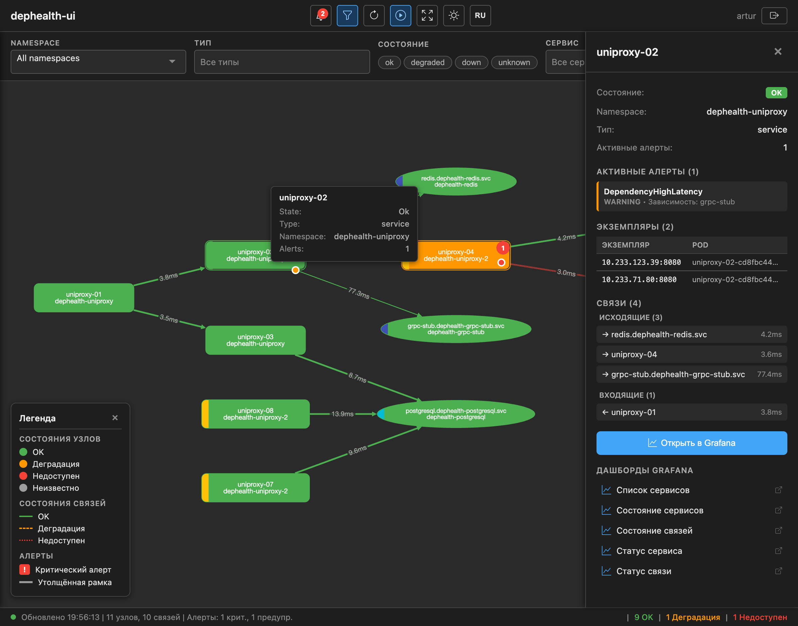

# dephealth-ui — Описание приложения

## Назначение

dephealth-ui — веб-приложение для визуализации топологии микросервисов и состояния их зависимостей в реальном времени. Отображает направленный граф сервисов с цветовой индикацией состояний (OK, DEGRADED, DOWN), значениями latency на связях и ссылками на dashboards в Grafana.

## Источники данных

Приложение получает данные из двух источников:

- **Prometheus / VictoriaMetrics** — метрики, собираемые проектом [topologymetrics](https://github.com/BigKAA/topologymetrics) (dephealth SDK)
- **AlertManager** — активные алерты по зависимостям

### Метрики topologymetrics

| Метрика | Тип | Значения | Описание |
|---------|-----|----------|----------|
| `app_dependency_health` | Gauge | `1` (здоров) / `0` (недоступен) | Состояние зависимости |
| `app_dependency_latency_seconds` | Histogram | секунды | Latency health check зависимости |

Histogram buckets: `0.001, 0.005, 0.01, 0.05, 0.1, 0.5, 1.0, 5.0`

### Labels (одинаковые для обеих метрик)

| Label | Обязательный | Описание | Пример |
|-------|:---:|----------|--------|
| `name` | да | Имя приложения (из SDK) | `uniproxy-01` |
| `dependency` | да | Логическое имя зависимости | `postgres-main` |
| `type` | да | Тип подключения | `http`, `grpc`, `tcp`, `postgres`, `mysql`, `redis`, `amqp`, `kafka` |
| `host` | да | Адрес endpoint | `pg-master.db.svc.cluster.local` |
| `port` | да | Порт endpoint | `5432` |
| `critical` | да | Критичность зависимости | `yes`, `no` |
| `role` | нет | Роль экземпляра | `primary`, `replica` |
| `shard` | нет | Идентификатор shard | `shard-01` |
| `vhost` | нет | AMQP virtual host | `/` |

### Модель графа

- **Узлы (nodes)** = Prometheus label `name` (имя приложения из dephealth SDK)
- **Рёбра (edges)** = комбинация `{name → dependency, type, host, port, critical}`
- Каждая уникальная комбинация `{name, dependency, host, port}` = одно направленное ребро
- Флаг `critical` определяет визуальную толщину ребра на графе

### Правила алертов (из Helm chart topologymetrics)

| Алерт | Условие | Severity |
|-------|---------|----------|
| `DependencyDown` | Все endpoints зависимости = 0 в течение 1 мин | critical |
| `DependencyDegraded` | Смешанные значения 0 и 1 для одной зависимости в течение 2 мин | warning |
| `DependencyHighLatency` | P99 > 1с в течение 5 мин | warning |
| `DependencyFlapping` | >4 смены состояния за 15 мин | info |
| `DependencyAbsent` | Метрики отсутствуют полностью в течение 5 мин | warning |

---

## Ограничения развёртывания

- **Сетевая изоляция:** приложение развёртывается **отдельно** от стека мониторинга. Prometheus/VictoriaMetrics и AlertManager находятся в другой сети, недоступной из браузеров пользователей.
- **Масштаб:** 100+ сервисов с dephealth SDK, тысячи рёбер зависимостей.
- **Аутентификация:** настраивается в конфигурации — без auth (внутренний инструмент), Basic auth или OIDC/SSO (Keycloak, LDAP).

**Следствие:** чистое SPA-приложение с Nginx-проксированием к Prometheus **невозможно**. Необходим серверный backend, который обращается к Prometheus/AlertManager и отдаёт фронтенду готовые данные графа.

---

## Архитектура

Комбинированное приложение: Go backend + JS frontend, поставляется как единый Docker-образ.

```
┌─────────────────────┐
│  Браузер (JS SPA)   │  ← Cytoscape.js, получает готовый JSON-граф
│  Cytoscape.js       │  ← Не знает про PromQL, не обращается к Prometheus
└────────┬────────────┘
         │ HTTPS (JSON REST API)
         ▼
┌─────────────────────────────────────┐
│  dephealth-ui (Go binary)           │  ← Единый binary, единый Docker image
│                                     │
│  ┌─ HTTP Server ──────────────────┐ │
│  │  GET /              → SPA      │ │  ← Раздаёт встроенные static-файлы
│  │  GET /api/v1/topology → handler│ │  ← Готовый граф топологии
│  │  GET /api/v1/alerts   → handler│ │  ← Агрегированные алерты
│  │  GET /api/v1/config   → handler│ │  ← Конфигурация для фронтенда
│  └────────────────────────────────┘ │
│                                     │
│  ┌─ Topology Service ─────────────┐ │
│  │  Запросы к Prometheus/VM API   │ │  ← Серверная сторона
│  │  Запросы к AlertManager API v2 │ │
│  │  Построение графа              │ │  ← Вычисление OK/DEGRADED/DOWN
│  │  Кэширование (15-60с TTL)     │ │  ← Один запрос обслуживает всех
│  └────────────────────────────────┘ │
│                                     │
│  ┌─ Auth Module (pluggable) ──────┐ │
│  │  type: "none"  → открытый      │ │  ← Настраивается через YAML/env
│  │  type: "basic" → user/password │ │
│  │  type: "oidc"  → SSO/Keycloak │ │
│  └────────────────────────────────┘ │
└──────────┬──────────────┬───────────┘
           │              │
           ▼              ▼
┌──────────────────┐ ┌────────────────┐
│ VictoriaMetrics  │ │  AlertManager  │
│ (отдельная сеть) │ │ (отдельная     │
│                  │ │  сеть)         │
└──────────────────┘ └────────────────┘
```

---

## Стек технологий

| Компонент | Выбор | Обоснование |
|-----------|-------|-------------|
| **Backend** | Go (`net/http` + `chi`) | Единый binary; официальная библиотека Prometheus client; минимальный Docker-образ (~15-20MB); соответствует K8s-экосистеме |
| **Frontend** | Vanilla JS + Vite | Компактное SPA; Cytoscape.js работает нативно; минимальный bundle; при росте — миграция на React |
| **Визуализация графа** | Cytoscape.js + cytoscape-dagre | Нативные постоянные подписи на рёбрах; CSS-подобные стили; `cy.batch()` для эффективного обновления; богатая экосистема layout |
| **Layout** | dagre | Оптимален для DAG-подобной топологии; быстрый; чистый hierarchical рендеринг |
| **Сборка frontend** | Vite | Быстрый dev server, оптимальный build, HMR |
| **Контейнеризация** | Docker (multi-stage) + Helm chart | Единый образ: Go binary со встроенными SPA static-файлами |

---

## Backend: зоны ответственности

| Ответственность | Детали |
|-----------------|--------|
| **Запросы к Prometheus** | `app_dependency_health`, latency histogram через `prometheus/client_golang/api/v1` |
| **Запросы к AlertManager** | `GET /api/v2/alerts` с фильтрами, стандартный HTTP client |
| **Построение графа** | Узлы из label `name`, рёбра из labels `dependency/type/host/port/critical` |
| **Вычисление состояний** | Корреляция метрик + алертов → OK / DEGRADED / DOWN для каждого узла и ребра |
| **Кэширование** | In-memory cache с настраиваемым TTL (по умолчанию 15с). Один цикл запросов к Prometheus обслуживает всех подключённых пользователей |
| **Генерация Grafana URL** | Формирование URL dashboards с правильными query-параметрами из конфигурации |
| **Auth middleware** | Pluggable: none (passthrough), Basic (bcrypt), OIDC (redirect flow + token validation) |
| **Раздача static-файлов** | SPA-ассеты встроены через Go `embed` package, раздаются по `/` |

---

## REST API

### `GET /api/v1/topology`

Возвращает полный граф топологии с предвычисленными состояниями:

```json
{
  "nodes": [
    {
      "id": "order-service",
      "label": "Order Service",
      "state": "ok",
      "type": "service",
      "dependencyCount": 3,
      "grafanaUrl": "https://grafana.example.com/d/dephealth-service-status?var-service=order-service"
    },
    {
      "id": "postgres-main",
      "label": "postgres-main",
      "state": "degraded",
      "type": "postgres"
    }
  ],
  "edges": [
    {
      "source": "order-service",
      "target": "postgres-main",
      "latency": "5.2ms",
      "latencyRaw": 0.0052,
      "health": 1,
      "state": "ok",
      "critical": true,
      "grafanaUrl": "https://grafana.example.com/d/dephealth-link-status?var-dependency=postgres-main&var-host=pg-host&var-port=5432"
    }
  ],
  "alerts": [
    {
      "service": "postgres-main",
      "alertname": "DependencyDegraded",
      "severity": "warning",
      "since": "2026-02-08T08:30:00Z"
    }
  ],
  "meta": {
    "cachedAt": "2026-02-08T09:15:30Z",
    "ttl": 15,
    "nodeCount": 42,
    "edgeCount": 187
  }
}
```

### `GET /api/v1/config`

Возвращает конфигурацию, необходимую фронтенду (Grafana base URL, dashboard UID, настройки отображения).

```json
{
  "grafana": {
    "baseUrl": "https://grafana.example.com",
    "dashboards": {
      "serviceStatus": "dephealth-service-status",
      "linkStatus": "dephealth-link-status",
      "serviceList": "dephealth-service-list",
      "servicesStatus": "dephealth-services-status",
      "linksStatus": "dephealth-links-status"
    }
  },
  "cache": {
    "ttl": 15
  },
  "auth": {
    "type": "oidc"
  },
  "alerts": {
    "severityLevels": [
      {"value": "critical", "color": "#f44336"},
      {"value": "warning", "color": "#ff9800"},
      {"value": "info", "color": "#2196f3"}
    ]
  }
}
```

**Dashboards:**

| UID | Назначение | Query-параметры |
|-----|-----------|-----------------|
| `serviceStatus` | Состояние одного сервиса | `?var-service=<name>` |
| `linkStatus` | Состояние одной зависимости | `?var-dependency=<dep>&var-host=<host>&var-port=<port>` |
| `serviceList` | Список всех сервисов | — |
| `servicesStatus` | Обзор состояния всех сервисов | — |
| `linksStatus` | Обзор состояния всех связей | — |

---

## Конфигурация приложения

```yaml
# dephealth-ui.yaml
server:
  listen: ":8080"

datasources:
  prometheus:
    url: "http://victoriametrics.monitoring.svc:8428"
    # или внешний: "https://vm.example.com"
    # опциональная Basic auth для самого Prometheus:
    # username: "reader"
    # password: "secret"
  alertmanager:
    url: "http://alertmanager.monitoring.svc:9093"

cache:
  ttl: 15s

auth:
  type: "none"   # "none" | "basic" | "oidc"
  # basic:
  #   users:
  #     - username: admin
  #       passwordHash: "$2a$..."
  # oidc:
  #   issuer: "https://keycloak.example.com/realms/infra"
  #   clientId: "dephealth-ui"
  #   clientSecret: "..."
  #   redirectUrl: "https://dephealth.example.com/auth/callback"

grafana:
  baseUrl: "https://grafana.example.com"
  dashboards:
    serviceStatus: "dephealth-service-status"
    linkStatus: "dephealth-link-status"
    serviceList: "dephealth-service-list"
    servicesStatus: "dephealth-services-status"
    linksStatus: "dephealth-links-status"
```

---

## Frontend: поведение

Frontend — тонкий слой визуализации. Вся трансформация данных происходит на backend.

### Основной цикл

1. Frontend запрашивает `GET /api/v1/topology` с интервалом, указанным в `meta.ttl`
2. Получает готовый JSON с узлами, рёбрами, алертами и meta-информацией
3. Обновляет граф Cytoscape.js через `cy.batch()` (эффективное массовое обновление)

### Визуализация

- **Узлы:** цвет зависит от `state` — зелёный (OK), жёлтый (DEGRADED), красный (DOWN); динамический размер по длине текста; цветная полоска namespace
- **Рёбра:** направленные стрелки с постоянными подписями latency; цвет ребра по `state`; толщина ребра по `critical` (критичные — толще)
- **Клик по узлу/ребру:** открывает боковую панель с деталями (состояние, namespace, инстансы, связи, алерты) и секцией ссылок на Grafana dashboards
- **Контекстное меню (правый клик):** Open in Grafana, Copy Grafana URL, Show Details
- **Layout:** dagre (hierarchical, направление `LR` или `TB`)


### Боковая панель (Sidebar)

При клике по узлу или ребру открывается боковая панель с:
- Основная информация (state, type, namespace)
- Активные алерты (с severity)
- Список инстансов (pod name, IP:port) — для service-узлов
- Связанные рёбра (входящие/исходящие с latency)
- Кнопка «Open in Grafana» (открывает serviceStatus/linkStatus dashboard)
- Секция **Grafana Dashboards** — 5 ссылок на все dashboards с контекстно-зависимыми query-параметрами:
  - Обзорные (serviceList, servicesStatus, linksStatus) — без параметров
  - serviceStatus — с `?var-service=<name>` для выбранного сервиса
  - linkStatus — с `?var-dependency=...&var-host=...&var-port=...` для выбранной зависимости


### Интернационализация (i18n)

Фронтенд поддерживает EN и RU. Кнопка переключения языка в тулбаре. Все элементы UI, фильтры, легенда, статусбар, боковая панель и контекстное меню локализованы. Язык сохраняется в `localStorage`.

| EN | RU |
|----|----|
|  |  |

---

## Развёртывание

### Docker

Multi-stage build:
1. **Stage 1 (frontend):** Node.js + Vite → собирает SPA в `dist/`
2. **Stage 2 (backend):** Go → компилирует binary со встроенными static-файлами из Stage 1
3. **Stage 3 (runtime):** Минимальный образ (scratch / distroless) с единственным binary

Результат: Docker-образ ~15-20MB.

### Helm Chart

- Deployment с одним контейнером
- ConfigMap для `dephealth-ui.yaml`
- Secret для auth credentials (basic passwords, OIDC client secret)
- Service (ClusterIP или LoadBalancer)
- HTTPRoute (Gateway API) для внешнего доступа
- Опциональный Certificate (cert-manager) для TLS

### Конфигурация через environment

Все параметры из YAML можно переопределить через переменные окружения:
- `DEPHEALTH_SERVER_LISTEN`
- `DEPHEALTH_DATASOURCES_PROMETHEUS_URL`
- `DEPHEALTH_DATASOURCES_ALERTMANAGER_URL`
- `DEPHEALTH_CACHE_TTL`
- `DEPHEALTH_AUTH_TYPE`
- `DEPHEALTH_GRAFANA_BASEURL`

---

## PromQL-запросы (выполняются на backend)

```promql
# Все рёбра топологии
group by (name, namespace, dependency, type, host, port, critical) (app_dependency_health)

# Текущее состояние всех зависимостей
app_dependency_health

# Средняя latency
rate(app_dependency_latency_seconds_sum[5m]) / rate(app_dependency_latency_seconds_count[5m])

# P99 latency
histogram_quantile(0.99, rate(app_dependency_latency_seconds_bucket[5m]))

# Degraded: часть endpoints up, часть down
(count by (name, namespace, dependency, type) (app_dependency_health == 0) > 0)
and
(count by (name, namespace, dependency, type) (app_dependency_health == 1) > 0)
```

---

## Оценка трудозатрат

| Компонент | Дни |
|-----------|-----|
| Go: проект, HTTP server, конфигурация | 1-2 |
| Go: Prometheus API client + построение графа | 3-4 |
| Go: AlertManager API client + вычисление состояний | 2-3 |
| Go: кэширование | 1 |
| Go: Auth middleware (none + basic + OIDC) | 2-3 |
| Frontend: Vite + Cytoscape.js + рендеринг графа | 3-4 |
| Frontend: переход в Grafana по клику | 1 |
| Docker multi-stage build + Helm chart | 1-2 |
| Тестирование (Go unit + frontend) | 1-2 |
| **Итого** | **15-22** |

---

## Фазы разработки

1. **Фаза 1:** Go-проект + Prometheus API client + построение графа + базовый HTTP API
2. **Фаза 2:** Frontend (Vite + Cytoscape.js) + рендеринг графа из API
3. **Фаза 3:** AlertManager интеграция + вычисление состояний (OK/DEGRADED/DOWN)
4. **Фаза 4:** Auth middleware (none + basic), кэширование, конфигурация
5. **Фаза 5:** Docker multi-stage build + Helm chart + развёртывание в тестовый кластер
6. **Фаза 6:** OIDC auth, доработки (тёмная тема, адаптивная вёрстка, обработка ошибок)
