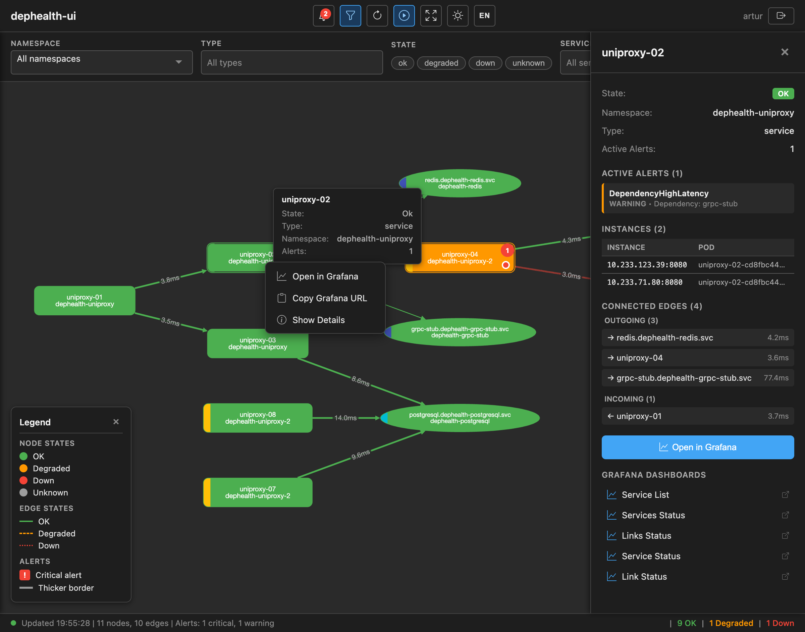
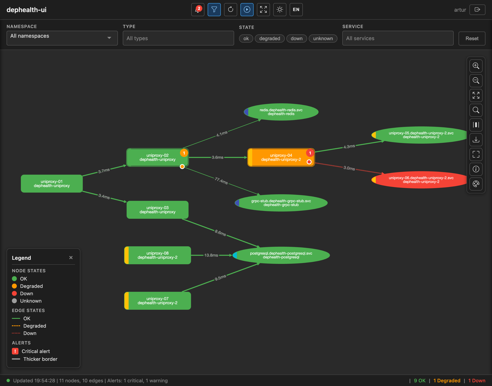
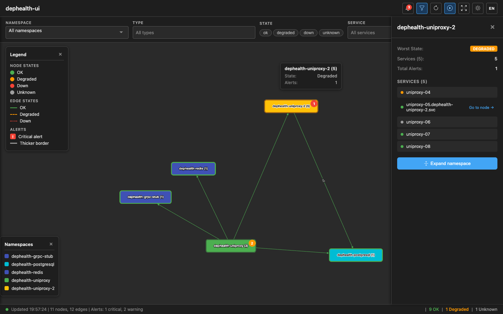
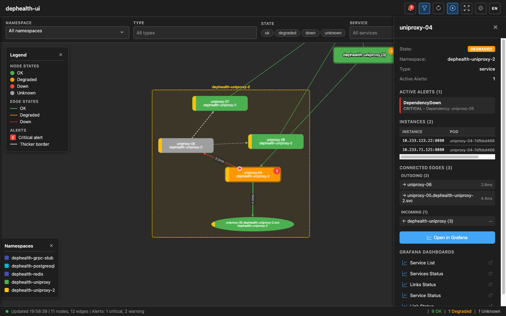
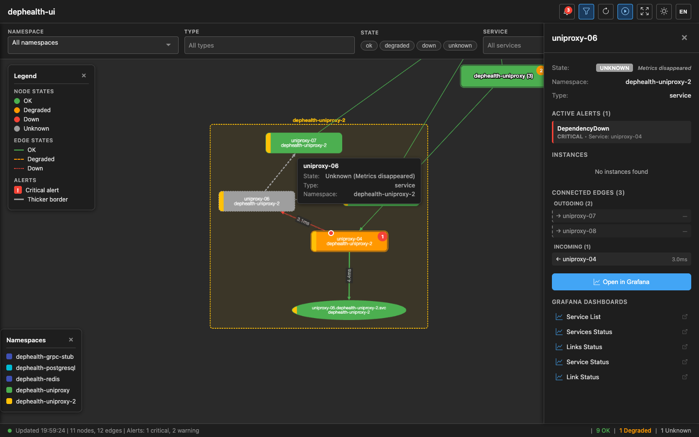
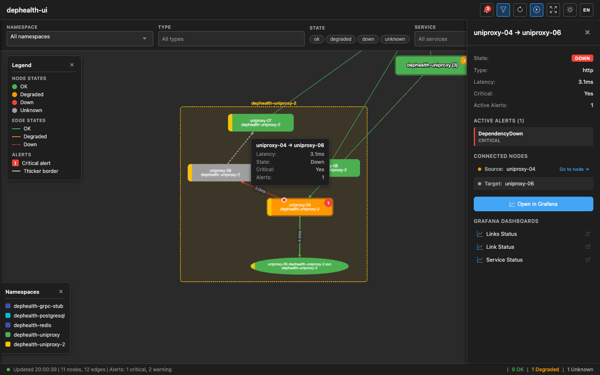
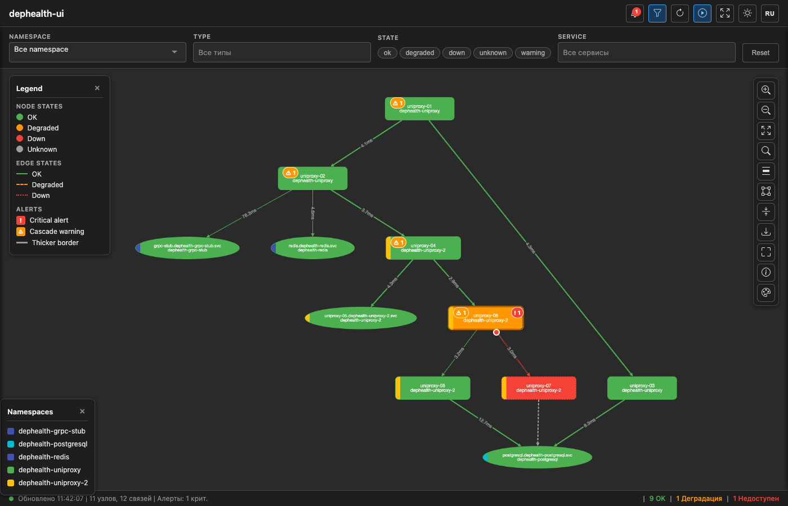
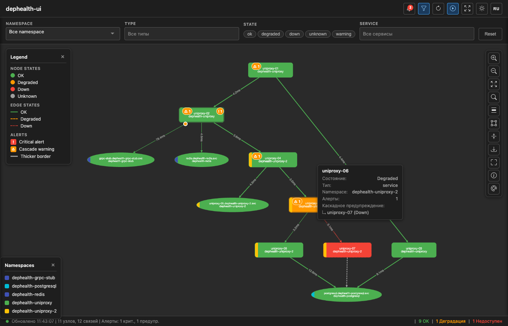
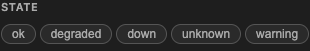

# dephealth-ui — Проектирование приложения

**Язык:** [English](./application-design.md) | Русский

---

## Назначение

dephealth-ui — веб-приложение для визуализации топологии микросервисов и состояния их зависимостей в реальном времени. Отображает направленный граф сервисов с цветовой индикацией состояний (OK, DEGRADED, DOWN, Unknown), значениями latency на связях и ссылками на dashboards в Grafana.

## Источники данных

Приложение получает данные из двух источников:

- **Prometheus / VictoriaMetrics** — метрики, собираемые проектом [topologymetrics](https://github.com/BigKAA/topologymetrics) (dephealth SDK)
- **AlertManager** — активные алерты по зависимостям

### Метрики topologymetrics

| Метрика | Тип | Значения | Описание |
|---------|-----|----------|----------|
| `app_dependency_health` | Gauge | `1` (здоров) / `0` (недоступен) | Состояние зависимости |
| `app_dependency_latency_seconds` | Histogram | секунды | Latency health check зависимости |

Histogram buckets: `0.001, 0.005, 0.01, 0.05, 0.1, 0.5, 1.0, 5.0`

### Labels (одинаковые для обеих метрик)

| Label | Обязательный | Описание | Пример |
|-------|:---:|----------|--------|
| `name` | да | Имя приложения (из SDK) | `uniproxy-01` |
| `dependency` | да | Логическое имя зависимости | `postgres-main` |
| `type` | да | Тип подключения | `http`, `grpc`, `tcp`, `postgres`, `mysql`, `redis`, `amqp`, `kafka` |
| `host` | да | Адрес endpoint | `pg-master.db.svc.cluster.local` |
| `port` | да | Порт endpoint | `5432` |
| `critical` | да | Критичность зависимости | `yes`, `no` |
| `role` | нет | Роль экземпляра | `primary`, `replica` |
| `shard` | нет | Идентификатор shard | `shard-01` |
| `vhost` | нет | AMQP virtual host | `/` |

### Модель графа

- **Узлы (nodes)** = Prometheus label `name` (имя приложения из dephealth SDK)
- **Рёбра (edges)** = комбинация `{name → dependency, type, host, port, critical}`
- Каждая уникальная комбинация `{name, dependency, host, port}` = одно направленное ребро
- Флаг `critical` определяет визуальную толщину ребра на графе

### Правила алертов (из Helm chart topologymetrics)

| Алерт | Условие | Severity |
|-------|---------|----------|
| `DependencyDown` | Все endpoints зависимости = 0 в течение 1 мин | critical |
| `DependencyDegraded` | Смешанные значения 0 и 1 для одной зависимости в течение 2 мин | warning |
| `DependencyHighLatency` | P99 > 1с в течение 5 мин | warning |
| `DependencyFlapping` | >4 смены состояния за 15 мин | info |
| `DependencyAbsent` | Метрики отсутствуют полностью в течение 5 мин | warning |

---

## Ограничения развёртывания

- **Сетевая изоляция:** приложение развёртывается **отдельно** от стека мониторинга. Prometheus/VictoriaMetrics и AlertManager находятся в другой сети, недоступной из браузеров пользователей.
- **Масштаб:** 100+ сервисов с dephealth SDK, тысячи рёбер зависимостей.
- **Аутентификация:** настраивается в конфигурации — без auth (внутренний инструмент), Basic auth или OIDC/SSO (Keycloak, LDAP).

**Следствие:** чистое SPA-приложение с Nginx-проксированием к Prometheus **невозможно**. Необходим серверный backend, который обращается к Prometheus/AlertManager и отдаёт фронтенду готовые данные графа.

---

## Архитектура

Комбинированное приложение: Go backend + JS frontend, поставляется как единый Docker-образ.

```
┌─────────────────────┐
│  Браузер (JS SPA)   │  ← Cytoscape.js, получает готовый JSON-граф
│  Cytoscape.js       │  ← Не знает про PromQL, не обращается к Prometheus
└────────┬────────────┘
         │ HTTPS (JSON REST API)
         ▼
┌─────────────────────────────────────┐
│  dephealth-ui (Go binary)           │  ← Единый binary, единый Docker image
│                                     │
│  ┌─ HTTP Server ──────────────────┐ │
│  │  GET /              → SPA      │ │  ← Раздаёт встроенные static-файлы
│  │  GET /api/v1/topology → handler│ │  ← Готовый граф топологии
│  │  GET /api/v1/alerts   → handler│ │  ← Агрегированные алерты
│  │  GET /api/v1/config   → handler│ │  ← Конфигурация для фронтенда
│  │  GET /api/v1/export/* → handler│ │  ← Экспорт графа (JSON/CSV/DOT/PNG/SVG)
│  └────────────────────────────────┘ │
│                                     │
│  ┌─ Topology Service ─────────────┐ │
│  │  Запросы к Prometheus/VM API   │ │  ← Серверная сторона
│  │  Запросы к AlertManager API v2 │ │
│  │  Построение графа              │ │  ← Вычисление OK/DEGRADED/DOWN
│  │  Кэширование (15-60с TTL)     │ │  ← Один запрос обслуживает всех
│  └────────────────────────────────┘ │
│                                     │
│  ┌─ Auth Module (pluggable) ──────┐ │
│  │  type: "none"  → открытый      │ │  ← Настраивается через YAML/env
│  │  type: "basic" → user/password │ │
│  │  type: "oidc"  → SSO/Keycloak │ │
│  └────────────────────────────────┘ │
└──────────┬──────────────┬───────────┘
           │              │
           ▼              ▼
┌──────────────────┐ ┌────────────────┐
│ VictoriaMetrics  │ │  AlertManager  │
│ (отдельная сеть) │ │ (отдельная     │
│                  │ │  сеть)         │
└──────────────────┘ └────────────────┘
```

---

## Стек технологий

| Компонент | Выбор | Обоснование |
|-----------|-------|-------------|
| **Backend** | Go (`net/http` + `chi`) | Единый binary; официальная библиотека Prometheus client; минимальный Docker-образ (~15-20MB); соответствует K8s-экосистеме |
| **Frontend** | Vanilla JS + Vite | Компактное SPA; Cytoscape.js работает нативно; минимальный bundle; при росте — миграция на React |
| **Визуализация графа** | Cytoscape.js + dagre + fcose | Нативные постоянные подписи на рёбрах; CSS-подобные стили; `cy.batch()` для эффективного обновления; богатая экосистема layout |
| **Layout** | dagre (flat) / fcose (grouped) | dagre — оптимален для DAG-подобной топологии в плоском режиме; fcose — force-directed layout для группировки по измерению (namespace или group) с compound nodes |
| **Сборка frontend** | Vite | Быстрый dev server, оптимальный build, HMR |
| **Контейнеризация** | Docker (multi-stage) + Helm chart | Единый образ: Go binary со встроенными SPA static-файлами |

---

## Backend: зоны ответственности

| Ответственность | Детали |
|-----------------|--------|
| **Запросы к Prometheus** | `app_dependency_health`, latency histogram через `prometheus/client_golang/api/v1` |
| **Запросы к AlertManager** | `GET /api/v2/alerts` с фильтрами, стандартный HTTP client |
| **Построение графа** | Узлы из label `name`, рёбра из labels `dependency/type/host/port/critical` |
| **Вычисление состояний** | Корреляция метрик + алертов → OK / DEGRADED / DOWN для каждого узла и ребра |
| **Кэширование** | In-memory cache с настраиваемым TTL (по умолчанию 15с). Один цикл запросов к Prometheus обслуживает всех подключённых пользователей |
| **Генерация Grafana URL** | Формирование URL dashboards с правильными query-параметрами из конфигурации |
| **Auth middleware** | Pluggable: none (passthrough), Basic (bcrypt), OIDC (redirect flow + token validation) |
| **Раздача static-файлов** | SPA-ассеты встроены через Go `embed` package, раздаются по `/` |
| **Экспорт графа** | Мультиформатный экспорт (JSON, CSV, DOT, PNG, SVG) через пакет `internal/export`; интеграция с Graphviz для рендеринга изображений |

---

## Модель состояний

dephealth-ui использует модель из 4 состояний для узлов и рёбер:

| Состояние | Цвет | Описание |
|-----------|------|----------|
| **ok** | Зелёный (`#4caf50`) | Все зависимости здоровы |
| **degraded** | Жёлтый (`#ff9800`) | Некоторые зависимости недоступны, сервис работает |
| **down** | Красный (`#f44336`) | Сервис недоступен (все рёбра stale или действительно down) |
| **unknown** | Серый (`#9e9e9e`) | Нет данных (нет рёбер или все рёбра stale) |

### Состояние сервис-ноды (Backend)

Backend вычисляет состояние сервис-ноды в `calcServiceNodeState()` по здоровью исходящих рёбер:

- **Нет рёбер** → `unknown`
- **Любое ребро с health=0** → `degraded`
- **Все рёбра здоровы (health=1)** → `ok`

> **Важно:** `calcServiceNodeState` никогда не возвращает `"down"`. Backend присваивает сервис-нодам только `ok`, `degraded` или `unknown`. Состояние `down` устанавливается только когда **все** исходящие рёбра stale (метрики пропали) — это обрабатывается логикой stale detection.

### Состояние dependency-ноды (Backend)

Dependency-ноды определяют состояние по входящим рёбрам:

- **Все входящие рёбра stale** → `down` (с `stale=true`)
- **Смешанные stale/live** → состояние из non-stale рёбер
- **health=1** → `ok`
- **health=0** → `down`

### Состояние ребра

| Условие | Состояние |
|---------|-----------|
| health=1 | `ok` |
| health=0 | `down` |
| Stale (метрики пропали) | `unknown` |

### Расширения состояний на фронтенде

Фронтенд расширяет модель состояний каскадными предупреждениями (см. [Каскадные предупреждения](#каскадные-предупреждения)). Узлы, получающие каскадное распространение, показывают бейдж `⚠ N` и попадают в виртуальный фильтр `warning`.

---

## REST API

### `GET /api/v1/topology`

Возвращает полный граф топологии с предвычисленными состояниями:

```json
{
  "nodes": [
    {
      "id": "order-service",
      "label": "Order Service",
      "state": "ok",
      "type": "service",
      "dependencyCount": 3,
      "grafanaUrl": "https://grafana.example.com/d/dephealth-service-status?var-service=order-service"
    },
    {
      "id": "postgres-main",
      "label": "postgres-main",
      "state": "degraded",
      "type": "postgres"
    }
  ],
  "edges": [
    {
      "source": "order-service",
      "target": "postgres-main",
      "latency": "5.2ms",
      "latencyRaw": 0.0052,
      "health": 1,
      "state": "ok",
      "critical": true,
      "grafanaUrl": "https://grafana.example.com/d/dephealth-link-status?var-dependency=postgres-main&var-host=pg-host&var-port=5432"
    }
  ],
  "alerts": [
    {
      "service": "postgres-main",
      "alertname": "DependencyDegraded",
      "severity": "warning",
      "since": "2026-02-08T08:30:00Z"
    }
  ],
  "meta": {
    "cachedAt": "2026-02-08T09:15:30Z",
    "ttl": 15,
    "nodeCount": 42,
    "edgeCount": 187
  }
}
```

### `GET /api/v1/config`

Возвращает конфигурацию, необходимую фронтенду (Grafana base URL, dashboard UID, настройки отображения).

```json
{
  "grafana": {
    "baseUrl": "https://grafana.example.com",
    "dashboards": {
      "serviceStatus": "dephealth-service-status",
      "linkStatus": "dephealth-link-status",
      "serviceList": "dephealth-service-list",
      "servicesStatus": "dephealth-services-status",
      "linksStatus": "dephealth-links-status"
    }
  },
  "cache": { "ttl": 15 },
  "auth": { "type": "oidc" },
  "alerts": {
    "severityLevels": [
      {"value": "critical", "color": "#f44336"},
      {"value": "warning", "color": "#ff9800"},
      {"value": "info", "color": "#2196f3"}
    ]
  }
}
```

**Dashboards:**

| UID | Назначение | Query-параметры |
|-----|-----------|-----------------|
| `serviceStatus` | Состояние одного сервиса | `?var-service=<name>` |
| `linkStatus` | Состояние одной зависимости | `?var-dependency=<dep>&var-host=<host>&var-port=<port>` |
| `serviceList` | Список всех сервисов | — |
| `servicesStatus` | Обзор состояния всех сервисов | — |
| `linksStatus` | Обзор состояния всех связей | — |

---

## Конфигурация приложения

```yaml
# dephealth-ui.yaml
server:
  listen: ":8080"

datasources:
  prometheus:
    url: "http://victoriametrics.monitoring.svc:8428"
    # username: "reader"
    # password: "secret"
  alertmanager:
    url: "http://alertmanager.monitoring.svc:9093"

cache:
  ttl: 15s

auth:
  type: "none"   # "none" | "basic" | "oidc"

grafana:
  baseUrl: "https://grafana.example.com"
  dashboards:
    serviceStatus: "dephealth-service-status"
    linkStatus: "dephealth-link-status"
    serviceList: "dephealth-service-list"
    servicesStatus: "dephealth-services-status"
    linksStatus: "dephealth-links-status"

topology:
  lookback: "0"  # "0" = отключено, "1h", "6h", "24h"
```

---

## Frontend: поведение

Frontend — тонкий слой визуализации. Вся трансформация данных происходит на backend.

### Основной цикл

1. Frontend запрашивает `GET /api/v1/topology` с интервалом, указанным в `meta.ttl`
2. Получает готовый JSON с узлами, рёбрами, алертами и meta-информацией
3. Обновляет граф Cytoscape.js через `cy.batch()` (эффективное массовое обновление)

### Визуализация

- **Узлы:** цвет зависит от `state` — зелёный (OK), жёлтый (DEGRADED), красный (DOWN), серый (Unknown/stale); динамический размер по длине текста; цветная полоска namespace
- **Рёбра:** направленные стрелки с постоянными подписями latency; цвет ребра по `state`; толщина ребра по `critical` (критичные — толще)
- **Stale-ноды:** серый фон (`#9e9e9e`), пунктирная рамка, скрытая latency; tooltip «Метрики пропали»
- **Клик по узлу/ребру:** открывает боковую панель с деталями (состояние, namespace, инстансы, связи, алерты) и секцией ссылок на Grafana dashboards
- **Контекстное меню (правый клик):** Открыть в Grafana, Копировать URL, Детали
- **Layout:** dagre (плоский режим, LR/TB) или fcose (режим группировки по измерению)



### Визуальная группировка (измерения)

Группировка визуально объединяет сервисы в составные узлы (compound nodes) Cytoscape.js по выбранному **измерению**:
- **Namespace** — Kubernetes namespace (по умолчанию, доступен для всех сервисов)
- **Group** — логическая метка группы из SDK v0.5.0+ (метка `group` на метриках)

Кнопка-переключатель на панели инструментов (**NS** / **ГРП**) переключает активное измерение. Выбор сохраняется в `localStorage` и отражается в URL (`?dimension=group` или `?dimension=namespace`).

**Детали измерения Group:**
- Узлы-сервисы отображают цветную полосу и метку `gr: <group>` в режиме группировки по группам
- Узлы-зависимости (Redis, PostgreSQL и т.д.) не имеют метки `group` — в режиме группировки по группам полоса не отображается
- Выпадающий фильтр переключается между значениями «Namespace» и «Группа» в зависимости от активного измерения
- Легенда namespace/group обновляется для показа значений и цветов активного измерения
- Если ни один узел в топологии не имеет поля `group`, переключатель скрывается и автоматически используется режим namespace

**Режимы:**
- **Flat mode (dagre):** все узлы отображаются на одном уровне, layout dagre
- **Grouped mode (fcose):** узлы сгруппированы в контейнеры по измерению, layout fcose

**Collapse/Expand:**
- Двойной клик по группе или кнопка «Развернуть» в sidebar → сворачивание/разворачивание
- Свёрнутая группа показывает: наихудшее состояние детей, количество сервисов, суммарные алерты
- Рёбра между свёрнутыми группами автоматически агрегируются (показывают count `×N`)
- Состояние collapse/expand сохраняется в `localStorage`
- При обновлении данных (auto-refresh) — свёрнутые группы остаются свёрнутыми

**Click-to-expand навигация:**
- В sidebar свёрнутой группы — кликабельный список сервисов с цветными индикаторами состояния
- Клик по сервису → группа разворачивается → камера центрируется на выбранном сервисе → sidebar показывает детали сервиса
- В sidebar ребра — клик по узлу из свёрнутой группы также разворачивает и навигирует к оригинальному сервису





### Боковая панель (Sidebar)

Три типа боковых панелей:

**1. Node Sidebar** — при клике по узлу-сервису:
- Основная информация (state, type, namespace, group)
- Активные алерты (с severity)
- Список инстансов (pod name, IP:port) — для service-узлов
- Связанные рёбра (входящие/исходящие с latency и навигацией)
- Кнопка «Open in Grafana» (открывает serviceStatus dashboard)
- Секция **Grafana Dashboards** — ссылки на все dashboards с контекстно-зависимыми query-параметрами





**2. Edge Sidebar** — при клике по ребру:
- Состояние, тип, latency, критичность
- Активные алерты для данной связи
- Связанные узлы (source/target) с кликабельной навигацией
- Кнопка «Open in Grafana» (открывает linkStatus dashboard)
- Секция Grafana Dashboards



**3. Collapsed Namespace Sidebar** — при клике по свёрнутому namespace:
- Наихудшее состояние, количество сервисов, суммарные алерты
- Кликабельный список сервисов с цветными точками состояния и стрелкой «Перейти к узлу →»
- Кнопка «Развернуть namespace»

### Интернационализация (i18n)

Фронтенд поддерживает EN и RU. Кнопка переключения языка в тулбаре. Все элементы UI, фильтры, легенда, статусбар, боковая панель и контекстное меню локализованы. Язык сохраняется в `localStorage`.

| EN | RU |
|----|----|
|  |  |

### Каскадные предупреждения

Каскадные предупреждения визуализируют распространение сбоев через критические зависимости. Когда сервис падает, все вышестоящие сервисы, критически зависящие от него (прямо или транзитивно), получают индикаторы каскадного предупреждения с указанием корневой причины.

**Ключевой принцип:** Каскадные предупреждения распространяются только через рёбра с `critical=true`. Сбои некритических зависимостей не вызывают каскадное распространение.

#### Алгоритм

Каскадные вычисления выполняются целиком на фронтенде (`cascade.js`) после каждого обновления данных:

**Фаза 1 — Поиск корневых причин** (`findRealRootCauses`):
Для каждой `down` сервис-ноды — прослеживание вниз по критическим рёбрам до реально недоступной зависимости (терминальная корневая причина). Пример: если `A(down) → B(critical) → C(unknown)`, корневая причина — `C`, а не `A`.

**Фаза 2 — BFS вверх** (`computeCascadeWarnings`):
От каждой `down` сервис-ноды — BFS вверх по входящим критическим рёбрам. Каждый вышестоящий узел (не находящийся в состоянии `down`) получает данные каскадного предупреждения с указанием реальной корневой причины.

```
fetchTopology() → renderGraph() → computeCascadeWarnings(cy) → updateBadges()
```

#### Свойства данных узла

| Свойство | Тип | Описание |
|----------|-----|----------|
| `cascadeCount` | number | Количество различных корневых причин, влияющих на узел |
| `cascadeSources` | string[] | Массив ID узлов — корневых причин |
| `inCascadeChain` | boolean | `true` для узлов в цепочке сбоя (down-ноды + корневые причины) — используется системой фильтров |

#### Визуальное представление

- **Бейдж каскада:** `⚠ N` в форме pill на верхнем левом углу затронутых узлов (N = количество корневых причин)
- **Tooltip:** показывает «Каскадное предупреждение: ↳ service-name (state)» для каждой корневой причины
- **Down-ноды** не показывают каскадные бейджи (они сами являются причиной сбоя, а не получателем предупреждения)





#### Фильтры состояний

Панель фильтров включает виртуальное состояние `warning` наряду с backend-состояниями:



#### Интеграция с фильтрами

Система фильтров включает виртуальное состояние `warning` (не является backend-состоянием):

- Узел соответствует `warning`, если `cascadeCount > 0` и `state !== 'down'`
- Узлы с `inCascadeChain=true` также соответствуют фильтру `warning` (показывает полную цепочку сбоя)

**Pass 1.5 — Видимость цепочки degraded/down:**
При активном фильтре `degraded` или `down` система фильтров также показывает нижележащие non-ok зависимости, чтобы пользователь видел ПОЧЕМУ узел degraded или down.

---

## Режим истории (History Mode)

Режим истории позволяет путешествовать во времени по графу топологии, просматривая состояние зависимостей в любой момент прошлого.

### Архитектура

```
Браузер                          Go Backend                    VictoriaMetrics
  │                                  │                              │
  │  /api/v1/topology?time=T         │                              │
  ├─────────────────────────────────►│  query(promql, at=T)         │
  │                                  ├─────────────────────────────►│
  │                                  │  /api/v1/query?time=T        │
  │  {meta: {isHistory:true, time:T}}│◄─────────────────────────────┤
  │◄─────────────────────────────────┤                              │
  │                                  │                              │
  │  /api/v1/timeline/events         │  query_range(start,end,step) │
  │  ?start=S&end=E                  │                              │
  ├─────────────────────────────────►├─────────────────────────────►│
  │  [{timestamp,service,kind}]      │◄─────────────────────────────┤
  │◄─────────────────────────────────┤  detect transitions          │
```

**Backend:**
- Все Prometheus-запросы принимают опциональный параметр `time`. При его наличии используется параметр Prometheus `/api/v1/query?time=<unix_ts>` вместо текущего времени
- Исторические алерты восстанавливаются из метрики `ALERTS{alertstate="firing"}` на запрошенный момент (AlertManager не используется для исторических данных)
- Исторические запросы полностью обходят in-memory кэш (ни Get, ни Set)
- Окно `lookback` применяется относительно `opts.Time` для определения stale-нод
- Endpoint `/api/v1/timeline/events` использует `query_range` для обнаружения переходов `app_dependency_status` за временное окно с автоматически вычисляемым шагом

**Frontend:**
- Панель таймлайна: нижняя панель с пресетами диапазонов (1ч–90д), пользовательским вводом даты/времени и ползунком
- Маркеры событий: цветные маркеры на ползунке, отображающие переходы состояний (красный=деградация, зелёный=восстановление, оранжевый=изменение)
- Синхронизация URL: параметры `?time=`, `?from=`, `?to=` поддерживаются через `history.replaceState()` для расшариваемых ссылок
- Ссылки Grafana: в режиме истории все URL dashboards Grafana включают `&from=<ts-1h>&to=<ts+1h>` (Unix ms) для навигации к релевантному временному окну
- Автообновление приостанавливается в режиме истории и возобновляется при возврате в live-режим

### Сценарий использования

1. Нажмите кнопку History (иконка часов) в тулбаре
2. Выберите временной диапазон через пресеты или пользовательский ввод
3. Появляется ползунок с маркерами событий; перетащите для выбора момента
4. Граф обновляется при отпускании ползунка, показывая историческое состояние
5. Нажмите на маркер события для перехода к конкретному переходу
6. Скопируйте URL для передачи исторического вида коллегам
7. Нажмите «Live» для возврата в режим реального времени

---

## PromQL-запросы (выполняются на backend)

```promql
# Все рёбра топологии (instant)
group by (name, namespace, group, dependency, type, host, port, critical) (app_dependency_health)

# Все рёбра за lookback-окно (для stale node retention)
group by (name, namespace, group, dependency, type, host, port, critical) (last_over_time(app_dependency_health[LOOKBACK]))

# Текущее состояние всех зависимостей
app_dependency_health

# Средняя latency
rate(app_dependency_latency_seconds_sum[5m]) / rate(app_dependency_latency_seconds_count[5m])

# P99 latency
histogram_quantile(0.99, rate(app_dependency_latency_seconds_bucket[5m]))

# Degraded: часть endpoints up, часть down
(count by (name, namespace, dependency, type) (app_dependency_health == 0) > 0)
and
(count by (name, namespace, dependency, type) (app_dependency_health == 1) > 0)
```

> **Примечание:** Метка `group` является опциональной. При наличии (SDK v0.5.0+) она активирует переключатель измерения группировки в UI. При отсутствии система использует только группировку по namespace.

### Удержание stale-нод (lookback window)

Когда сервис перестаёт отправлять метрики (crash, scale-down, сетевые проблемы), его time series становятся «stale» в Prometheus через ~5 минут и исчезают из instant-запросов. По умолчанию узел просто пропадает с графа.

Функция **lookback window** (`topology.lookback`) сохраняет исчезнувшие узлы на графе в состоянии `state="unknown"` на настраиваемый период.

**Как это работает:**

1. **Topology query** использует `last_over_time(metric[LOOKBACK])` — возвращает ВСЕ рёбра за окно lookback (текущие + stale)
2. **Health query** использует instant-запрос — возвращает ТОЛЬКО текущие рёбра (живые time series)
3. Рёбра, присутствующие в topology, но НЕ в health → помечаются как **stale** (`state="unknown"`, `Stale=true`)
4. Узлы, где ВСЕ рёбра stale → `state="unknown"`; смешанные узлы используют non-stale рёбра для вычисления состояния

**Визуализация на фронтенде:**
- Stale-ноды: серый фон (`#9e9e9e`), пунктирная рамка
- Stale-рёбра: серые пунктирные линии, latency скрыта
- Tooltip показывает «Метрики пропали» / «Metrics disappeared»

**Конфигурация:** `topology.lookback` (по умолчанию: `0` = отключено). Рекомендуемые значения: `1h`, `6h`, `24h`. Минимум: `1m`. Env: `DEPHEALTH_TOPOLOGY_LOOKBACK`.

Совместимо с Prometheus и VictoriaMetrics (`last_over_time()` поддерживается обоими).

---

## Экспорт графа

Функция экспорта позволяет скачивать граф топологии в различных форматах для внешнего анализа, документирования или передачи коллегам.

### Поддерживаемые форматы

| Формат | Тип | Описание |
|--------|-----|----------|
| **JSON** | Данные | Структурированный экспорт с узлами, рёбрами и метаданными (версия, timestamp, scope, фильтры) |
| **CSV** | Данные | ZIP-архив с файлами `nodes.csv` + `edges.csv` с UTF-8 BOM |
| **DOT** | Данные | Формат Graphviz DOT с подграфами-кластерами по namespace/group и цветами по состоянию |
| **PNG** | Изображение | Растровое изображение через Graphviz с настраиваемым DPI (масштаб 1–4) |
| **SVG** | Изображение | Векторное изображение через Graphviz |

### Архитектура

Экспорт использует двойной подход:

- **«Текущий вид»** (фронтенд): `cy.png()` и `cy.svg()` — захватывает точное содержимое canvas Cytoscape.js как его видит пользователь, сохраняя layout, масштаб и свёрнутые группы
- **«Полный граф»** (бэкенд): `GET /api/v1/export/{format}` — генерирует полное серверное представление топологии через пакет `internal/export` и Graphviz

```
┌────────────────────────────────────────┐
│  Модальное окно экспорта (фронтенд)    │
│                                        │
│  Формат: [PNG] [SVG] [JSON] [CSV] [DOT]│
│  Scope:  ○ Текущий вид  ○ Полный граф │
│                                        │
│  Текущий вид + PNG/SVG                 │
│    → cy.png({full:true, scale:2})      │
│    → cy.svg({full:true})               │
│                                        │
│  Полный граф + любой формат            │
│    → fetch /api/v1/export/{format}     │
│    → Blob → скачивание                 │
└──────────────────┬─────────────────────┘
                   │ (бэкенд-форматы)
                   ▼
┌────────────────────────────────────────┐
│  Export Handler (Go бэкенд)            │
│                                        │
│  TopologyResponse                      │
│    → ConvertTopology() → ExportData    │
│    → ExportJSON / ExportCSV / ExportDOT│
│    → RenderDOT (png/svg через Graphviz)│
└──────────────────┬─────────────────────┘
                   │ (только PNG/SVG)
                   ▼
┌────────────────────────────────────────┐
│  Graphviz CLI (dot -Tpng/-Tsvg)       │
│  Установлен в Docker-образе (Alpine)   │
└────────────────────────────────────────┘
```

### Бэкенд-пакет экспорта (`internal/export/`)

| Файл | Назначение |
|------|-----------|
| `model.go` | Структуры `ExportData`, `ExportNode`, `ExportEdge`; конвертер `ConvertTopology()` |
| `json.go` | `ExportJSON()` — сериализация в форматированный JSON |
| `csv.go` | `ExportCSV()` — ZIP-архив с `nodes.csv` + `edges.csv` |
| `dot.go` | `ExportDOT()` — Graphviz DOT с кластерами, цветами, формами |
| `render.go` | `RenderDOT()` — вызов CLI `dot` с таймаутом 10с; проверка `GraphvizAvailable()` |

### Интеграция с Graphviz

Docker-образ включает Alpine-пакет `graphviz` (~55–65 МБ) для серверного рендеринга. Для рендеринга всех графов используется движок `dot`. Если Graphviz не установлен, экспорт PNG/SVG возвращает HTTP 503; остальные форматы (JSON, CSV, DOT) работают без Graphviz.

---

## Развёртывание

### Docker

Multi-stage build:
1. **Stage 1 (frontend):** Node.js + Vite → собирает SPA в `dist/`
2. **Stage 2 (backend):** Go → компилирует binary со встроенными static-файлами из Stage 1
3. **Stage 3 (runtime):** Образ на базе Alpine с Graphviz для рендеринга экспорта графов

Результат: Docker-образ ~80 МБ (Graphviz добавляет ~55–65 МБ к базовому образу).

### Helm Chart

- Deployment с одним контейнером
- ConfigMap для `dephealth-ui.yaml`
- Secret для auth credentials (basic passwords, OIDC client secret)
- Service (ClusterIP или LoadBalancer)
- HTTPRoute (Gateway API) для внешнего доступа
- Опциональный Certificate (cert-manager) для TLS

### Конфигурация через environment

Все параметры из YAML можно переопределить через переменные окружения:
- `DEPHEALTH_SERVER_LISTEN`
- `DEPHEALTH_DATASOURCES_PROMETHEUS_URL`
- `DEPHEALTH_DATASOURCES_ALERTMANAGER_URL`
- `DEPHEALTH_CACHE_TTL`
- `DEPHEALTH_AUTH_TYPE`
- `DEPHEALTH_GRAFANA_BASEURL`
- `DEPHEALTH_TOPOLOGY_LOOKBACK`

---

## Интеграция с Grafana

dephealth-ui генерирует прямые ссылки на дашборды Grafana из узлов сервисов, рёбер зависимостей и панелей каскадного анализа. При старте приложение проверяет доступность дашбордов через Grafana API (`/api/health` и `/api/dashboards/uid/{uid}`) и скрывает ссылки на ненайденные дашборды.

Аутентификация поддерживает три метода с приоритетом: **Service Account Token** > **Basic Auth** > **Без аутентификации**.

Подробнее о переменных дашбордов, генерации URL, настройке аутентификации и рекомендациях по безопасности см. [Интеграция с дашбордами Grafana](./grafana-dashboards.ru.md).

## См. также

- [Справочник REST API](./API.ru.md) — Все endpoint'ы и форматы ответов
- [Спецификация метрик](./METRICS.ru.md) — Формат обязательных метрик и руководство по интеграции
- [Дашборды Grafana](./grafana-dashboards.ru.md) — Интеграция с дашбордами и проверка доступности
- [Руководство по развёртыванию](../deploy/helm/dephealth-ui/README.ru.md) — Kubernetes & Helm
